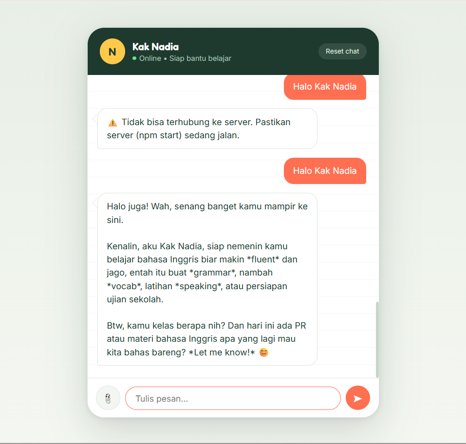
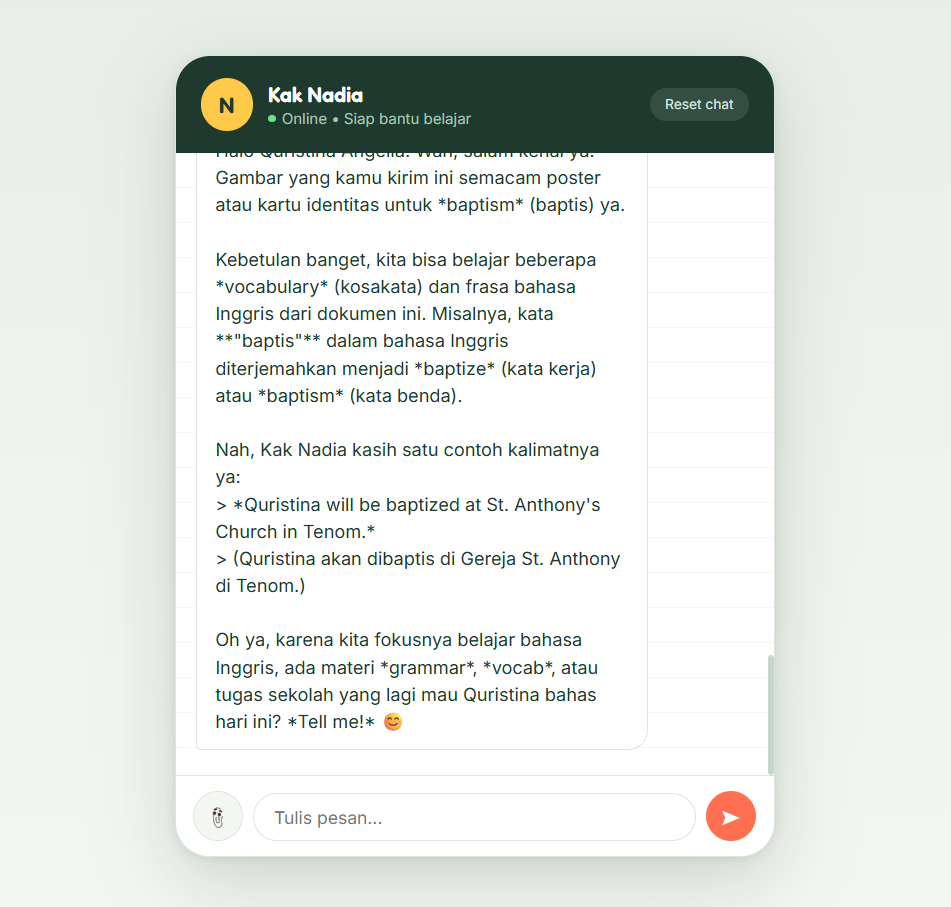
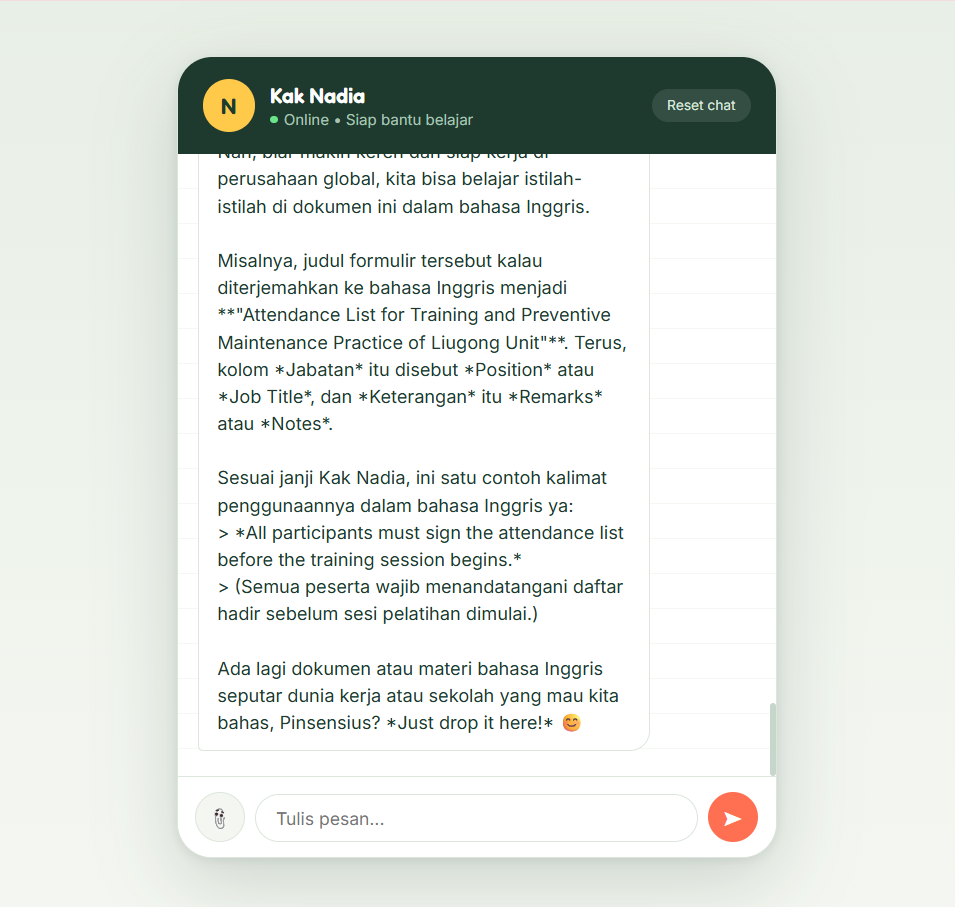
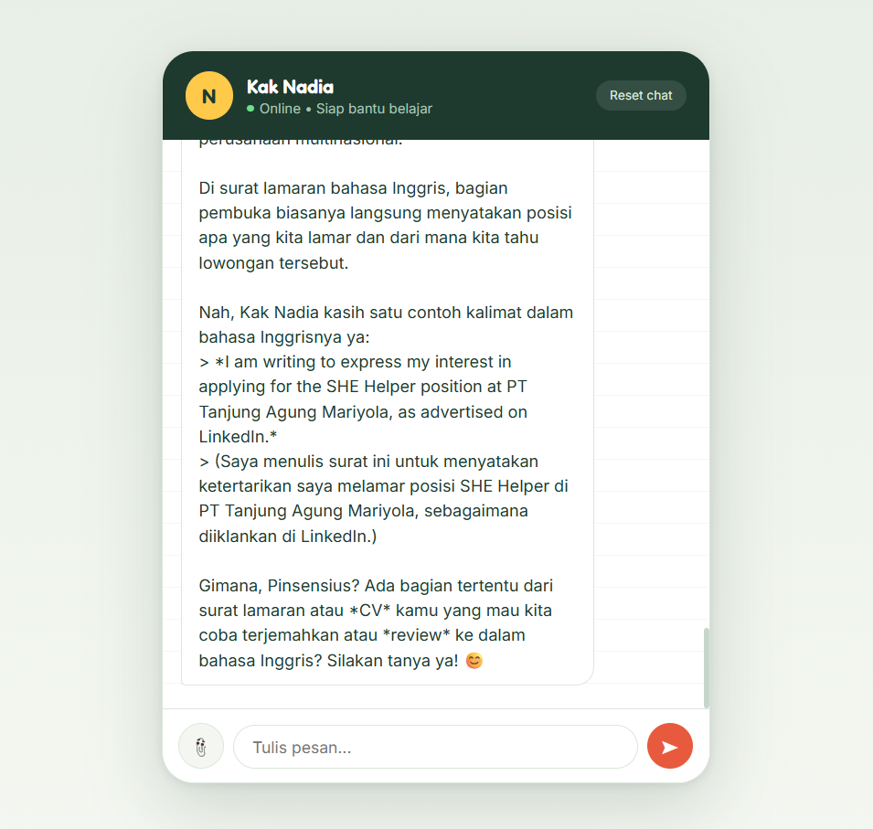

# Kak Nadia — Chatbot Asisten Belajar Bahasa Inggris

Chatbot berbasis AI yang membantu siswa SMA di Indonesia belajar bahasa Inggris dengan gaya santai dan interaktif. Dibangun menggunakan Google Gemini API sebagai model AI, dengan backend Node.js + Express dan antarmuka web sederhana.

## Use Case

**Kak Nadia** berperan sebagai kakak tingkat yang membantu siswa SMA belajar bahasa Inggris — grammar, vocabulary, percakapan sehari-hari, hingga tips menghadapi ujian. Gaya bahasanya santai dan ramah, mencampur Bahasa Indonesia dan Inggris seperti obrolan sehari-hari.

## Parameter Kreatif

| Parameter | Implementasi |
|---|---|
| **Gaya bahasa** | Santai, ramah, campuran Indonesia-Inggris (didefinisikan lewat system instruction) |
| **Domain spesifik** | Fokus hanya pada topik belajar bahasa Inggris; mengarahkan kembali dengan sopan jika user bertanya di luar topik |
| **Memory** | Menyimpan riwayat percakapan per sesi (`sessionId`), sehingga bot mengingat nama dan level belajar user selama sesi berlangsung |
| **Upload file multimodal** | Mendukung upload gambar, PDF, audio, video, dan dokumen Word (.docx) — bot dapat menganalisis isi file yang dikirim user |

## Model AI

Menggunakan **Gemini 3.5 Flash Lite** dari Google, diakses melalui SDK resmi `@google/genai`.

## Tech Stack

- **Backend:** Node.js, Express.js
- **AI Model:** Google Gemini API (`gemini-3.5-flash-lite`)
- **File upload:** Multer (penyimpanan sementara di memori)
- **Ekstraksi dokumen Word:** Mammoth
- **Frontend:** HTML, CSS, JavaScript (vanilla, tanpa framework)

## Struktur Folder

chatbotai/
├── config/
│   └── persona.js       # Konfigurasi persona & system instruction bot
├── public/
│   └── index.html        # Antarmuka chat (UI)
├── index.js               # Entry point server Express
├── package.json
└── .env                   # API key (tidak diunggah ke repo)

## Cara Menjalankan

1. Clone repository ini:
   git clone https://github.com/pinsensiusandreas/chatbot-kak-nadia.git
   cd chatbot-kak-nadia

2. Install dependency:
   npm install

3. Buat file `.env` di root folder, isi dengan API key Gemini:
   GEMINI_API_KEY=isi_api_key_kamu
   PORT=3000
   
   API key bisa didapatkan gratis di [Google AI Studio](https://aistudio.google.com).

4. Jalankan server:
   npm start

5. Buka browser ke `http://localhost:3000`

## Cara Pakai

- Ketik pesan di kotak chat, tekan Enter atau klik tombol kirim
- Klik ikon 📎 untuk melampirkan file (gambar, PDF, audio, video, atau Word)
- Klik **Reset chat** untuk memulai percakapan baru (menghapus memory sesi)

## Endpoint API

| Method | Endpoint | Deskripsi |
|---|---|---|
| `POST` | `/chat` | Kirim pesan (form-data: `sessionId`, `message`, `file` opsional) |
| `POST` | `/reset` | Reset memory percakapan (`sessionId`) |
| `GET` | `/` | Menyajikan antarmuka chat |

## Screenshot

Berikut contoh tampilan dan hasil percakapan chatbot:

---

Dibuat untuk memenuhi Final Project — AI Productivity and AI API Integration for Developers (Hacktiv8).